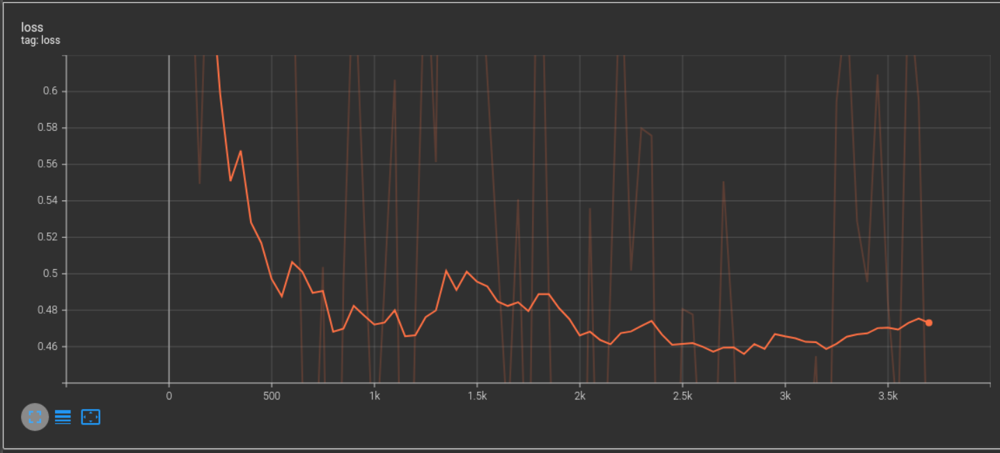

# Sentiment Analysis (DistilRoBERTa)
## Architecture
Based on [RoBERTa](https://arxiv.org/pdf/1907.11692.pdf) by [Meta AI](https://ai.facebook.com/) (Facebook)

I have just applied a classifier on the output of `cls_token`

**Classifier**
```
ClassifierHead(
  (linear1): Linear(in_features=768, out_features=384, bias=True)
  (linear2): Linear(in_features=384, out_features=1, bias=True)
  (dropout): Dropout(p=0.5, inplace=False)
)
```

## Results


It was trained for 4 epochs (took ~2 hours)\
[Trained Model](https://drive.google.com/file/d/1sHhIGvexAEryW9PRPACOnFvQUjyw5BWD/view?usp=sharing) is saved on google drive

```
Loss     = 0.397
Accuracy = 82.173%
```

## Demo
Note: Some reviews are copied from other branch for proper comparision\
Note: This model wasn't trained on movie reviews, instead it was trained on general tweets\
**Below are some predictions made by my model**

```
$ this movie is very great, i loved this movie 

Classified review as positive, 96.257%
```

```
$ this movie is very bad, i hated the movie

Classified review as negative, 91.513%
```

```
$ the movie was great but actors were worse. the story was cool but the ending wasn't

Classified review as negative, 80.917%
```

```
$ actors were worse but the movie was great. the ending was bad but the story was awesome

Classified review as positive, 64.931%
```

```
$ congrats krish for your model

Classified review as positive, 93.967%
```