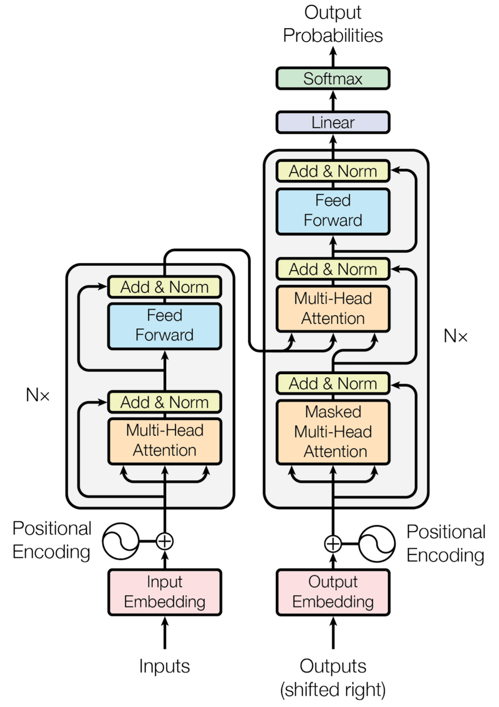

# Sentiment Analysis (Custom Transformer)

## Architecture

In my use case, i am passing the whole review to the encoder and
I am passing just the [CLS] token to the decoder, (In the second attention block there will be only one query, which indeed means the decoder will only output the weighted sum of the memory)
I have also removed the first attention block in decoder because i always just pass the [CLS] token which means the seq len will always be 1 and the softmax of the dot-product of query & key(s) will be always 1. which indeed states that the first attention block is just waste of time

Note: I also replaced the final activation with `sigmoid`

## Results
We've reached till a average binary loss of `0.025431151390075683`

## Demo
For this branch i haven't prepared any fancy demo, just run `demo.py` to test the model on your review using `cli`

**Below are some example runs made on demo.py**

```
Write a review about any movie
=> this movie is very great, i loved this movie 

Classified review as positive, 99.976%
```

```
Write a review about any movie
=> this movie is very bad, i hated the movie

Classified review as negative, 99.691%
```

```
Write a review about any movie
=> the movie was great but actors were worse. the story was cool but the ending wasn't

<=== Almost Neutral ===>
```