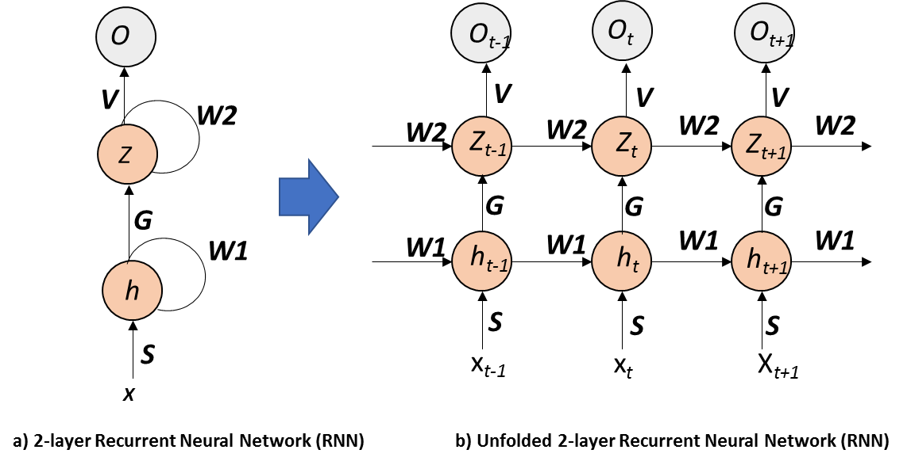
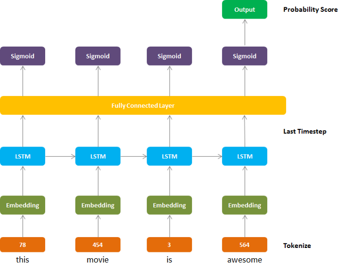
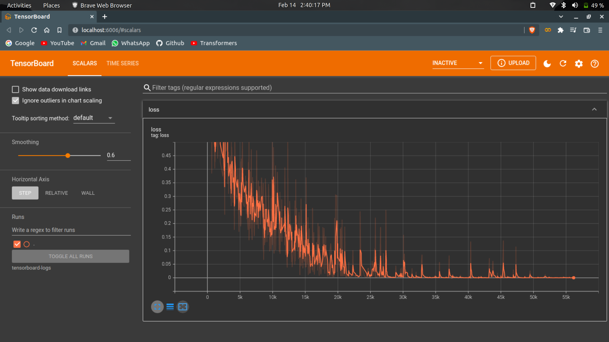
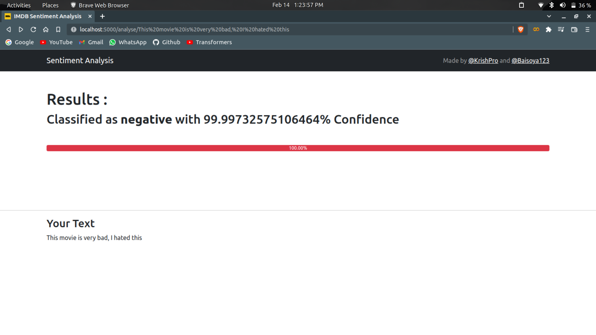
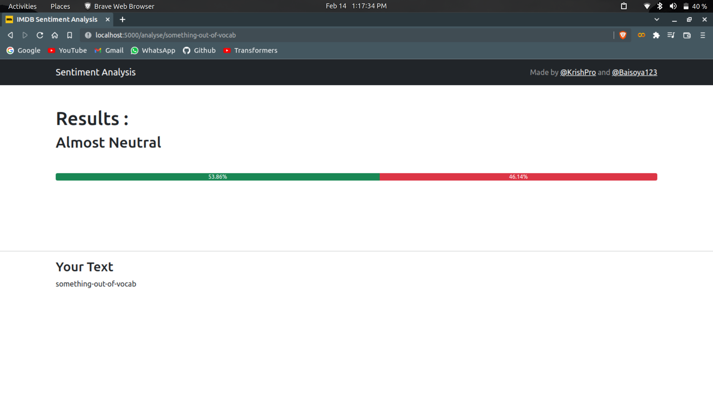

# Sentiment Analysis (Multi-Layer LSTM)

<h2><b>Multi-Layer LSTM</b></h2>

 

<h2><b>Many to One</b></h2>

# Arcitechtures
In our solution, I've combined both of the above images.

# Results
We got our binary loss down till 5e-3 (0.005)

# Demo
run [`demo/demo.py`](demo/demo.py) to see our demo running. Below are some screenshots

